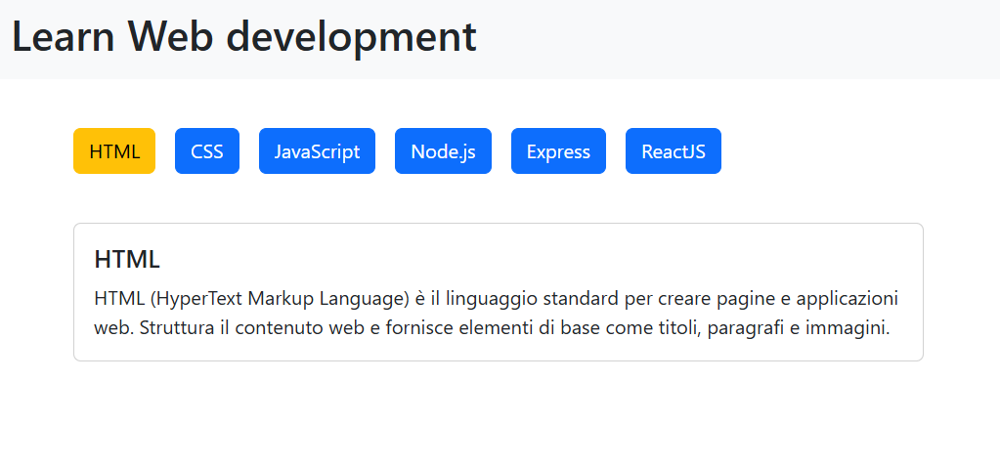

# React use state

Esercizio sull'utilizzo di useState

# Obiettivo
Dato un array di oggetti contenente i linguaggi del web e le loro descrizioni:

- Creare una serie di card che mostrano al loro interno un pulsante. Il testo del pulsante, corrisponde al nome del linguaggio.
- Se il pulsante viene cliccato, cambia colore e la descrizione diventa visibile all’interno della card.

## Bonus

- Creare una lista di pulsanti, uno per linguaggio.
- Sotto i pulsanti, inserisci una singola card. In partenza, questa card mostra il titolo e la descrizione del primo linguaggio nell’array.
- Fare in modo che, cliccando uno dei pulsanti, la card cambi contenuto e visualizzi il linguaggio corrispondente e la relativa descrizione

## Super Bonus

- Scomporre la card dei dettagli in un componente a parte che mantenga le sue funzionalità
- Scomporre i buttons in componenti a parte che mantengono tutte le funzionalità

# Screenshot

